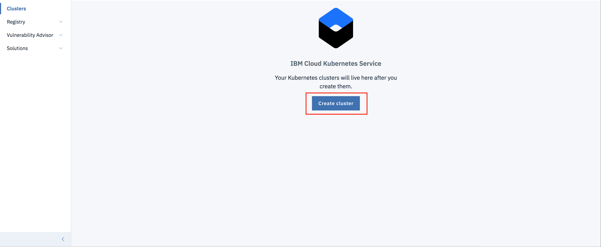

> 2014 - We must adopt microservices to solve all problems with monoliths.

> 2016 - We must adopt docker to solve all problems with microservices.

> 2018 - We must adopt kubernetes to solve all problems with docker.

Kubernetes is out there for quite sometime and people are hearing about its greater capabilities, but lot of them haven't started yet. If you are one of them, you are late to party, but that's ok; better late than never. Few developers I spoke with says there is no proper guide available (we can find lot of good articles spread across multiple websites than in a single place) or they fear starting something new. In this how-to, I am aiming to cover step by step instructions on building Containerized Flask Application Using Dockers and deploying it to IBM cloud Kubernetes Service.

## Learning objectives
After completing this how-to, the reader will be able to:

* Containerize a flask application using docker and deploy it to IBM cloud Kubernetes Service.

## Prerequisites

* IBM Cloud account - [sign up](https://console.bluemix.net/registration/) if you don't have an account yet.

* You will require Docker, download the latest version [Docker](https://www.docker.com/get-docker)

## Estimated time

To complete this how-to it should take around 45 minutes.

## Steps

### Create A Kubernetes Cluster

* Go to your IBM Cloud Dashboard and [Sign in](https://console.bluemix.net/dashboard/apps/)
* Go to IBM Container Service

* Click on Create Cluster

* Select the region where you want to deploy the cluster, give a name to your cluster and deploy.
* Depending upon your account (Paid or Free), select the appropriate cluster type.
* It takes some time for cluster to get ready (around 30 mins).

